# No 1

Mampu mendemonstrasikan penyelesaian masalah dengan pendekatan matematika dan algoritma pemrograman secara tepat (Lampirkan link source code terkait)

Jawab:

Ada beberapa pendekatan matematika dan algoritma yang project ini pakai, salah satunya:

-Pendekatan matematika method untuk memformat tanggal pesan dikirim atau diterima.

- Method ini menerima data chatContactData sebagai parameter.
- Kemudian, ia menghitung selisih antara waktu pengiriman pesan terakhir dengan waktu saat ini dalam satuan hari menggunakan fungsi "difference" pada objek DateTime.
- Jika selisih ini adalah 0, artinya pesan terakhir dikirim hari ini, maka method akan memformat waktu pengiriman pesan terakhir menggunakan DateFormat.Hm() dan menyimpan hasilnya dalam variabel formattedDate.
- Jika selisih ini adalah 1, artinya pesan terakhir dikirim kemarin, maka method akan menyimpan string "Kemarin" dalam variabel formattedDate.
- Jika selisih ini lebih besar dari 1, artinya pesan terakhir dikirim lebih dari 1 hari yang lalu, maka method akan memformat waktu pengiriman pesan terakhir menggunakan DateFormat('dd/MM/yyyy') dan menyimpan hasilnya dalam variabel formattedDate.
- Akhirnya, method mengembalikan nilai formattedDate sebagai output.

```dart
// Method ini menerima data chatContactData sebagai parameter.
  String getLastMessageFormattedDate(ChatContact chatContactData) {
    // mengurutkan waktu pesan terkahir
    String formattedDate = '';
    if (chatContactData.timeSent.difference(DateTime.now()).inDays == 0) {
      formattedDate = DateFormat.Hm().format(chatContactData.timeSent);
    } else if (chatContactData.timeSent
            .difference(DateTime.now().subtract(const Duration(days: 1)))
            .inDays ==
        0) {
      formattedDate = 'Kemarin';
    } else {
      formattedDate = DateFormat('dd/MM/yyyy').format(chatContactData.timeSent);
    }
    return formattedDate;
  }
```

Sedangkan untuk contoh algoritma pemrograman yang digunakan project ini adalah algoritma pengurutan pesan

- dimana pesan terbaru akan diurutkan paling atas dalam home chat screen, menggunakan fungsi bawaan sorting dart
- Fungsi sort((a, b) => b.timeSent.compareTo(a.timeSent)) menggunakan algoritma pengurutan (sorting algorithm) yang disebut dengan Merge Sort atau Mergesort.
-

```dart
// urutkan list berdasarkan waktu terkirim, pesan terbaru di atas
List<Message> sortMessagesByTimeSent(List<Message> messages) {
  return messages
      .sort((a, b) => b.timeSent.compareTo(a.timeSent));
}
```

# No 2

Mampu menjelaskan algoritma dari solusi yang dibuat (Lampirkan link source code terkait)

Jawab:

**Algoritma Chat**

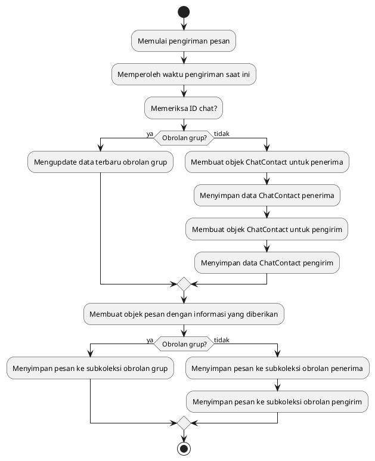

- [Pengimplementasian dari algoritma chat](https://gitlab.com/fikiaprian23/TA_OOP/-/blob/master/lib/features/chat/repositories/chat_repository.dart)

**Algoritma menampilkan nama kontak**

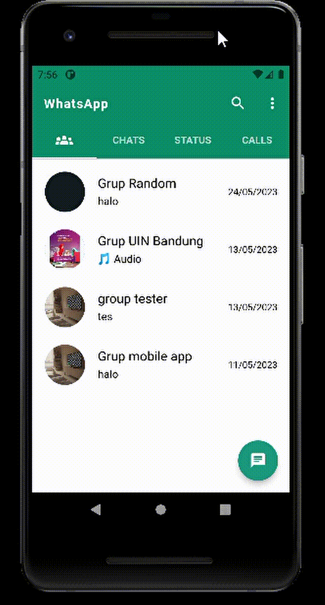

-Masalah lain yang muncul adalah bagaimana cara menggunakan nama dari nomer kontak bukan dari nama user yg diprofile.

Misalnya, nomer kita akan disimpan oleh user

- user1 memberi nama kontak kita budi
- user2 memberi nama kontak kita budiman
- user3 memberi nama kontak kita sarbudi

tentu saja hal ini sulit diselesaikan dengan menyimpan nama kontak ke database karena akan terlalu banyak list namanya

oleh karena itu saya membuat method getContactNameByNumber

- method ini akan mengambil semua data kontak user
- method ini meminta paramter nomer hp yng ingin dicari nama kontaknya
- kemudian dicocokan dengan looping setiap nomernya hingga cocok
- kalau nama ketemu akan mengambalikan nama kontak tsb
- kalau tidak ketemu nama akan di isi nomer hp

```dart
  Future<String?> getContactNameByNumber(String phoneNumber) async {
    try {
      final contacts = await FlutterContacts.getContacts(withProperties: true);
      String? contactName;

      for (var contact in contacts) {
        for (var phone in contact.phones) {
          String formattedPhoneNumber =
              '+${phone.number.replaceAll(RegExp(r'[^0-9]'), '')}';

          if (formattedPhoneNumber == phoneNumber) {
            contactName = contact.displayName;
            break;
          }
        }
      }

      return contactName;
    } catch (e) {
      print('Error getting contacts: $e');
      return null;
    }
  }
```

- hanya saja dengan algoritma ini membuat program tidak efesien karena kalau kita punya banyak kontak, maka sistem harus mencocokan satu-satu agar nama dapat ditampilkan

# No 3

Mampu menjelaskan konsep dasar OOP

Jawab:

- Abstraction: Memperlihatkan fungsi utama dari Class yang dibutuhkan oleh publik dan menyembunyikan detail pelaksanaannya.
- Encapsulation: membatasi akses langsung ke data atau metod di dalam kelas dan mengatur akses tersebut.
- Inheritance: penurunan sikap dan perilaku dari Orang Tua (Parent / Superclass) ke Anaknya (Child / Subclass).
- Polymorphism :Subclass dapat memiliki implementasi method yang berbeda dari Superclass nya (banyak bentuk).

Paradigma pemrograman berorientasi objek (OOP) banyak digunakan oleh developer karena memungkinkan pemrograman yang modular, reusabilitas kode, memudahkan pengembangan aplikasi yang lebih besar dan kompleks, kolaborasi tim yang efektif, dan peningkatan keamanan. OOP menyediakan kerangka kerja yang terstruktur dan mudah dipahami, yang membuat pengembangan perangkat lunak lebih efisien dan mudah dipelihara.

# No 4

Mampu mendemonstrasikan penggunaan Encapsulation secara tepat (Lampirkan link source code terkait)

Jawab:

Encapsulation membatasi akses langsung ke data atau metode di dalam kelas dan mengatur akses tersebut.

- pada Dart akses modifier terdapat 2 yaitu publik dan private
- Private ditandai dengan (\_) pada atribut atau methodnya. contoh dalam program saya

```dart
class _AuthRepository {
  final FirebaseAuth _auth;
  final FirebaseFirestore _firestore;
  // Constructor AuthRepository
  _AuthRepository({
    required FirebaseAuth auth,
    required FirebaseFirestore firestore,
  })  : _auth = auth,
        _firestore = firestore;

// Method untuk mengambil data user saat ini
  Future<UserModel?> getCurrentUserData() async {
    var userData =
        await _firestore.collection('users').doc(_auth.currentUser?.uid).get();

    UserModel? user;
    if (userData.data() != null) {
      user = UserModel.fromMap(userData.data()!);
    }
    return user;
  }

// Method untuk melakukan sign in dengan nomor telepon
  Future<void> signInWithPhone(BuildContext context, String phoneNumber) async {
    try {
      showLoadingDialog(
        context: context,
        message: "Sending a verification code to $phoneNumber",
      );
      await _auth.verifyPhoneNumber(
        phoneNumber: phoneNumber,
        verificationCompleted: (PhoneAuthCredential credential) async {
          await _auth.signInWithCredential(credential);
          // ignore: use_build_context_synchronously
          Navigator.pushNamedAndRemoveUntil(
            context,
            UserInformationScreen.routeName,
            (route) => false,
          );
        },
        verificationFailed: (e) {
          showAlertDialog(context: context, message: e.toString());
        },
        codeSent: ((String verificationId, int? resendToken) async {
          Navigator.pushNamed(
            context,
            OTPScreen.routeName,
            arguments: verificationId,
          );
        }),
        codeAutoRetrievalTimeout: (String verificationId) {},
      );
    } on FirebaseAuthException catch (e) {
      Navigator.pop(context);
      showAlertDialog(context: context, message: e.message!);
    }
  }

// Method untuk memverifikasi kode OTP
  void verifyOTP({
    required BuildContext context,
    required String verificationId,
    required String userOTP,
  }) async {
    try {
      showLoadingDialog(
        context: context,
        message: 'Verifiying code ... ',
      );
      PhoneAuthCredential credential = PhoneAuthProvider.credential(
        verificationId: verificationId,
        smsCode: userOTP,
      );
      await _auth.signInWithCredential(credential);
      // ignore: use_build_context_synchronously
      Navigator.pushNamedAndRemoveUntil(
        context,
        UserInformationScreen.routeName,
        (route) => false,
      );
    } on FirebaseAuthException catch (e) {
      showAlertDialog(context: context, message: e.message!);
    }
  }

// Method untuk menyimpan data user ke firebase
  void saveUserDataToFirebase({
    required String name,
    required File? profilePic,
    required ProviderRef ref,
    required BuildContext context,
  }) async {
    try {
      showLoadingDialog(
        context: context,
        message: "Saving user info ... ",
      );
      String uid = _auth.currentUser!.uid;
      String photoUrl =
          'https://png.pngitem.com/pimgs/s/649-6490124_katie-notopoulos-katienotopoulos-i-write-about-tech-round.png';

      if (profilePic != null) {
        photoUrl = await ref
            .read(commonFirebaseStorageRepositoryProvider)
            .storeFileToFirebase(
              'profilePic/$uid',
              profilePic,
            );
      }

      var user = UserModel(
        name: name,
        uid: uid,
        profilePic: photoUrl,
        isOnline: true,
        phoneNumber: _auth.currentUser!.phoneNumber!,
        groupId: [],
      );

      await _firestore.collection('users').doc(uid).set(user.toMap());

      // ignore: use_build_context_synchronously
      Navigator.pushAndRemoveUntil(
        context,
        MaterialPageRoute(
          builder: (context) => const MobileLayoutScreen(),
        ),
        (route) => false,
      );
    } catch (e) {
      showAlertDialog(context: context, message: e.toString());
    }
  }

// Mendapatkan data pengguna dari Firestore
  Stream<UserModel> userData(String userId) {
    return _firestore.collection('users').doc(userId).snapshots().map(
          (event) => UserModel.fromMap(
            event.data()!,
          ),
        );
  }

// Mengatur status pengguna apakah sedang online atau offline
  void setUserState(bool isOnline) async {
    await _firestore.collection('users').doc(_auth.currentUser!.uid).update({
      'isOnline': isOnline,
    });
  }
}

```

# No 5

Mampu mendemonstrasikan penggunaan Abstraction secara tepat (Lampirkan link source code terkait)

Jawab:

Abstraction: Memperlihatkan fungsi utama dari Class yang dibutuhkan oleh publik dan menyembunyikan detail pelaksanaannya.

- [Abstraction Auth](https://gitlab.com/fikiaprian23/TA_OOP/-/blob/master/lib/features/auth/abstraction/abstract_auth.dart)
- [Abstraction Call](https://gitlab.com/fikiaprian23/TA_OOP/-/blob/master/lib/features/call/abstraction/abstrct_call.dart)
- [Abstraction Chat](https://gitlab.com/fikiaprian23/TA_OOP/-/blob/master/lib/features/chat/abstraction/abstract_chat.dart)
- [Abstraction Group](https://gitlab.com/fikiaprian23/TA_OOP/-/blob/master/lib/features/group/abstraction/abstract_group.dart)
- [Abstraction Contacts](https://gitlab.com/fikiaprian23/TA_OOP/-/blob/master/lib/features/select_contacts/abstraction/abstract_contacts.dart)
- [Abstraction Status](https://gitlab.com/fikiaprian23/TA_OOP/-/blob/master/lib/features/status/abstraction/abstract_status.dart)

# No 6

Mampu mendemonstrasikan penggunaan Inheritance dan Polymorphism secara tepat (Lampirkan link source code terkait)

Jawab:

- Inheritance adalah konsep dimana sebuah class dapat mewarisi properti dan method yang ada pada class lainnya. Pada codingan tersebut, **LoginScreen** dijadikan child class dari **ConsumerStatefulWidget**, sehingga LoginScreen dapat menggunakan semua properti dan method yang ada pada ConsumerStatefulWidget, termasuk juga memodifikasi dan menambahkannya.
- Polymorphism adalah konsep dimana sebuah class dapat berubah bentuk atau tampilan sesuai dengan implementasinya. Dalam codingan tersebut, **\_LoginScreenState** merupakan child class dari **ConsumerState<LoginScreen>**, dimana \_LoginScreenState mengimplementasikan **build method** dengan memodifikasi tampilan dari LoginScreen. Dalam method build, terdapat implementasi dari Loader Widget ketika isLoading bernilai true, dan juga terdapat implementasi dari tampilan Scaffold ketika isLoading bernilai false.

```dart
 // extends--> inheritance
class LoginScreen extends ConsumerStatefulWidget {
  static const routeName = '/login-screen';
  const LoginScreen({Key? key}) : super(key: key);

  //override => Polymorphism
  @override
  ConsumerState<LoginScreen> createState() => _LoginScreenState();
}

class _LoginScreenState extends ConsumerState<LoginScreen> {
  final phoneController = TextEditingController();
  Country? country;
  bool isLoading = false;

  //override => Polymorphism
  @override
  void dispose() {
    super.dispose();
    phoneController.dispose();
  }

// fungsi untuk memilih negara menggunakan plugin country_picker_flutter
  void pickCountry() {
    showCountryPicker(
        context: context,
        onSelect: (Country _country) {
          setState(() {
            country = _country;
          });
        });
  }

// fungsi untuk mengirim nomor telepon pengguna yang telah dimasukkan
  sendPhoneNumber() async {
    // trim untuk menghapus spasi awal dan akhir string
    String phoneNumber = phoneController.text.trim();

    if (country != null && phoneNumber.isNotEmpty) {
      setState(() {
        isLoading = true;
      });
      await ref.read(authControllerProvider).signInWithPhone(
            context,
            '+${country!.phoneCode}$phoneNumber',
          );

      setState(() {
        isLoading = false;
      });
    } else {
      showAlertDialog(context: context, message: 'Fill out all the fields');
    }
  }

  //override => Polymorphism
  @override
  Widget build(BuildContext context) {
    final size = MediaQuery.of(context).size;
    if (isLoading) return const Loader();

    return Scaffold(
      appBar: AppBar(
        title: const Text('Enter your phone number'),
        elevation: 0,
        backgroundColor: greenButton,
      ),
      body: SingleChildScrollView(
        child: Padding(
          padding: const EdgeInsets.all(18.0),
          child: Column(
            crossAxisAlignment: CrossAxisAlignment.center,
            children: [
              const Text('WhatsApp will need to verify your phone number.'),
              const SizedBox(height: 10),
              TextButton(
                onPressed: pickCountry,
                child: const Text('Pick Country'),
              ),
              const SizedBox(height: 5),
              Row(
                children: [
                  if (country != null) Text('+${country!.phoneCode}'),
                  const SizedBox(width: 10),
                  SizedBox(
                    width: size.width * 0.7,
                    child: TextField(
                      controller: phoneController,
                      decoration: const InputDecoration(
                        hintText: 'phone number',
                      ),
                    ),
                  ),
                ],
              ),
              SizedBox(height: size.height * 0.5),
              SizedBox(
                width: 90,
                child: CustomButton(
                  onPressed: sendPhoneNumber,
                  text: 'NEXT',
                ),
              ),
            ],
          ),
        ),
      ),
    );
  }
}

```

# No 7

Mampu menjelaskan rancangan dalam bentuk Class Diagram, dan Use Case table (Lampirkan diagram terkait)

Jawab:

**USE CASE DIAGRAM**

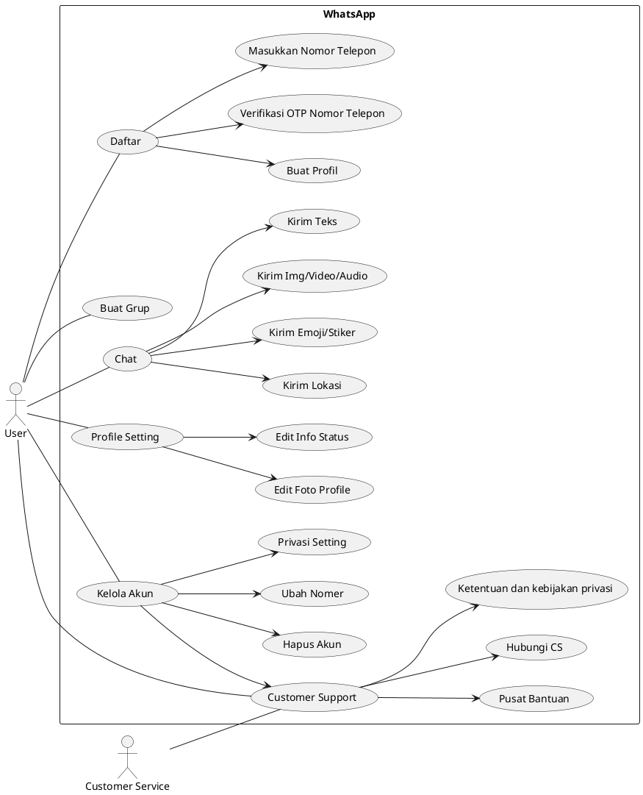

**USE CASE PRIORITY**
| Use Case | Priority | Status | Class Terkait |
|---------------------------|----------|----------|----------------------------------|
| Registrasi | Tinggi | Selesai | User, AuthController |
| Liat kontak | Tinggi | Selesai | Contact, ContactController |
| Mengirim Pesan Teks | Tinggi | Selesai | Message, ChatController |
| Mengirim Pesan Suara | Tinggi | Selesai | Message, ChatController |
| Mengirim Pesan Video | Tinggi | Selesai | Message, ChatController |
| Menerima Pesan | Tinggi | Selesai | Message, ChatController |
| Menyimpan Pesan | Tinggi | Selesai | Message, ChatController |
| Membuat Grup | Tinggi | Selesai | Group, GroupController |
| Mengirim Pesan di Grup | Tinggi | Selesai | Group, Message, GroupController, ChatController |
| Panggilan Suara | Tinggi | Belum | Call, CallController |
| Panggilan Video | Tinggi | Ongoing | Call, CallController |
| Mengirim Berkas | Tinggi | Belum | File, FileController |
| Menyimpan Riwayat Panggilan | Sedang | Baru UI | Call, CallController |
| Mengatur Notifikasi | Sedang | Belum | Notification, NotificationController |
| Buat Status Teman | Sedang | Baru UI | Status, StatusController |
| Melihat Status Teman | Sedang | Baru UI | Status, StatusController |
| Lihat Profil teman | Sedang | Selesai | User, UserController |
| Ubah pengaturan | Sedang | Belum | Setting, SettingController |
| Customer Support | Sedang | Belum | Customer,User,Setting, SettingController |

**CLASS DIAGRAM**

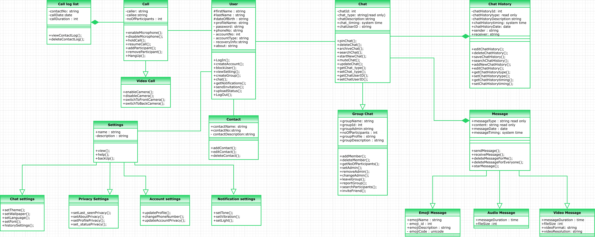

# No 8

Mampu menerjemahkan proses bisnis ke dalam skema OOP secara tepat. Bagaimana cara Kamu mendeskripsikan proses bisnis (kumpulan use case) ke dalam OOP ?

Jawab:

- Pertama-tama saya membuat use case scenarionya, agar mendapat gambaran skema dan proses bisnis yang akan saya buat.
- Identifikasi aktor-aktor yang terlibat dalam proses bisnis, seperti pengguna, sistem, dan sebagainya.
- Identifikasi use case-use case yang terkait dengan proses bisnis, seperti registrasi, mengirim pesan, menerima pesan, dan sebagainya.
- Identifikasi objek-objek yang terlibat dalam proses bisnis, seperti pesan, grup, kontak, dan sebagainya.
- Membuat kelas-kelas(Class Diagram digunakan untuk pemodelan OOP) yang merepresentasikan aktor, use case, dan objek yang telah diidentifikasi dalam proses bisnis.
- Hubungkan kelas-kelas tersebut dengan relasi objek-objek, seperti kelas pesan yang memiliki hubungan dengan kelas kontak dan kelas grup.
- Implementasikan method-method yang dibutuhkan dalam setiap kelas, seperti method untuk mengirim pesan, menerima pesan, membuat grup, dan sebagainya.
- Uji coba model OOP yang telah dibuat untuk memastikan konsistensi dan fungsionalitasnya.

# No 9

Mampu memberikan gambaran umum aplikasi kepada publik menggunakan presentasi berbasis video (Lampirkan link Youtube terkait)

Jawab:

**Video Demo Project**


**[Link Youtube](https://youtu.be/XR-BveZi0fU)**

# No 10

Inovasi UX (Lampirkan url screenshot aplikasi di Gitlab / Github)

Jawab:

- **Landing page**

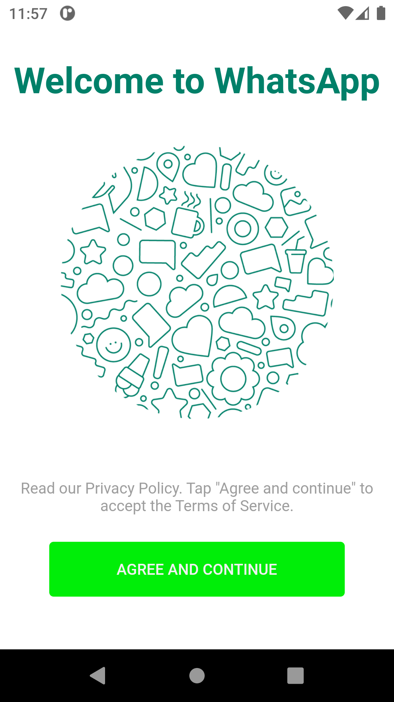

- **Register**

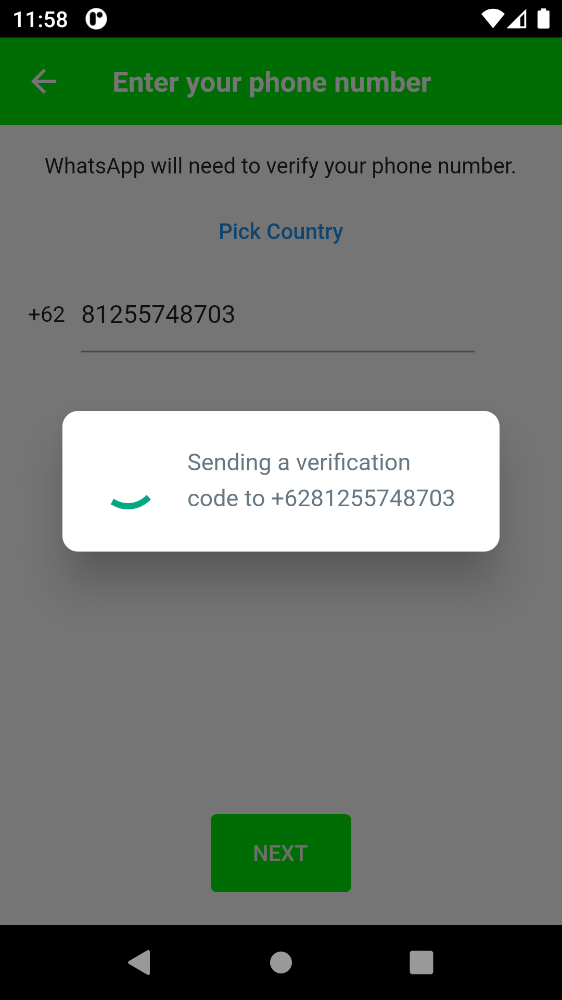

- **OTP**


- **Grup**

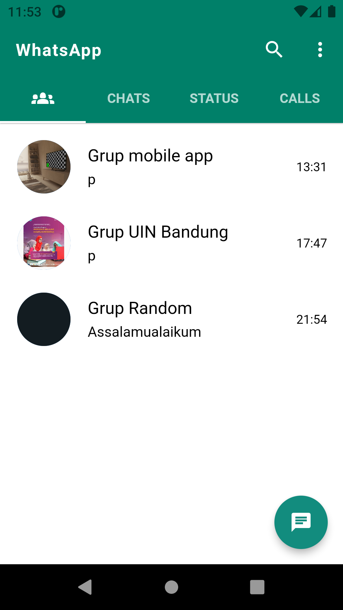

- **User Chat**

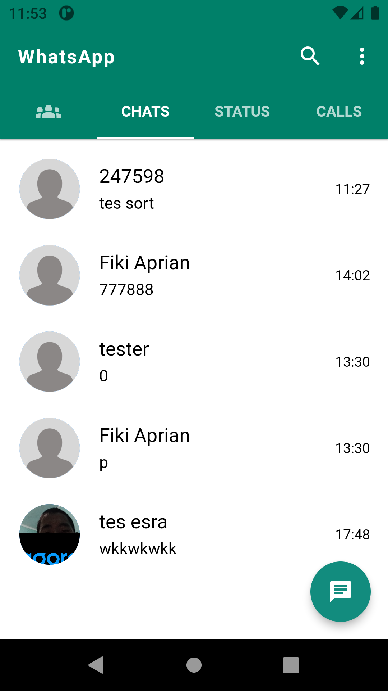

- **History call**

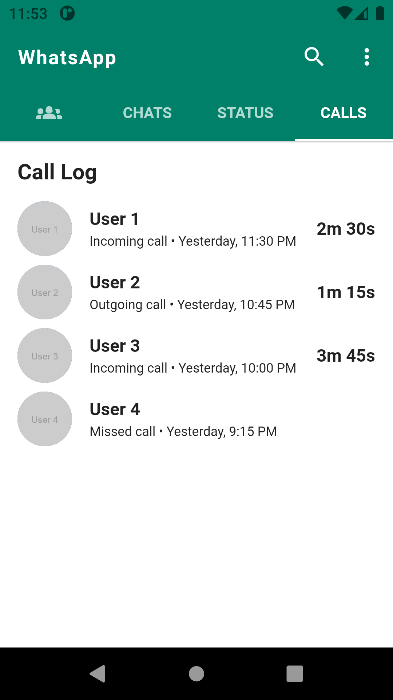

- **Status**

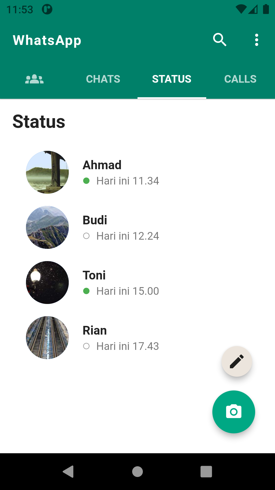

- **Select Contact**


- **Chat Grup**


- **Chat Personal**

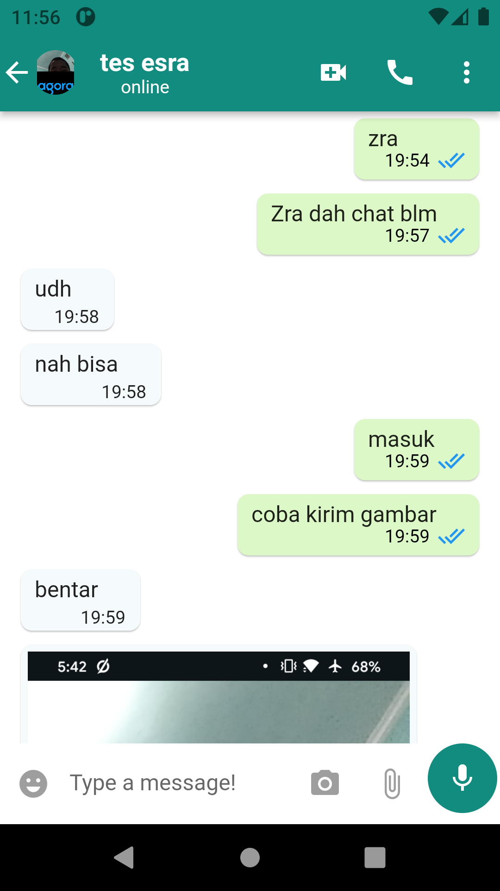

- **Profile teman**


