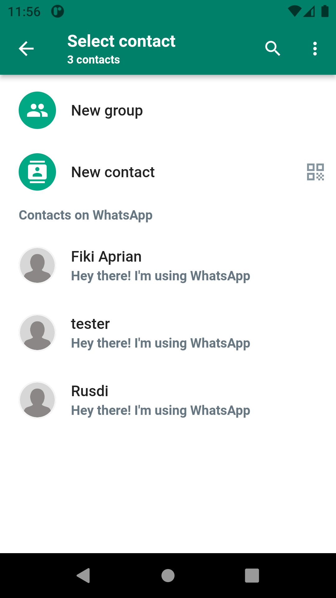

# No 1

Mampu mendemonstrasikan penyelesaian masalah dengan pendekatan matematika dan algoritma pemrograman secara tepat (Lampirkan link source code terkait)

Jawab:

# No 2

Mampu menjelaskan algoritma dari solusi yang dibuat (Lampirkan link source code terkait)

Jawab:

# No 3

Mampu menjelaskan konsep dasar OOP

Jawab:

# No 4

Mampu mendemonstrasikan penggunaan Encapsulation secara tepat (Lampirkan link source code terkait)

Jawab:

Encapsulation membatasi akses langsung ke data atau metode di dalam kelas dan mengatur akses tersebut.

- pada Dart akses modifier terdapat 2 yaitu publik dan private
- Private ditandai dengan (\_) pada atribut atau methodnya. contoh dalam program saya
- **\_saveDataToContactsSubcollection**
- **\_saveMessageToMessageSubcollection**

```dart
// fungsi untuk mengirim pesan text
  void sendTextMessage({
    required BuildContext context,
    required String text,
    required String recieverUserId,
    required UserModel senderUser,
    required MessageReply? messageReply,
    required bool isGroupChat,
  }) async {
    try {
      var timeSent = DateTime.now();
      UserModel? recieverUserData;

      if (!isGroupChat) {
        var userDataMap =
            await firestore.collection('users').doc(recieverUserId).get();
        recieverUserData = UserModel.fromMap(userDataMap.data()!);
      }

      var messageId = const Uuid().v1();

      _saveDataToContactsSubcollection(
        senderUser,
        recieverUserData,
        text,
        timeSent,
        recieverUserId,
        isGroupChat,
      );

      _saveMessageToMessageSubcollection(
        recieverUserId: recieverUserId,
        text: text,
        timeSent: timeSent,
        messageType: MessageEnum.text,
        messageId: messageId,
        username: senderUser.name,
        messageReply: messageReply,
        recieverUserName: recieverUserData?.name,
        senderUsername: senderUser.name,
        isGroupChat: isGroupChat,
      );
    } catch (e) {
      showSnackBar(context: context, content: e.toString());
    }
  }
```

# No 5

Mampu mendemonstrasikan penggunaan Abstraction secara tepat (Lampirkan link source code terkait)

Jawab:

- [Abstraction Auth](https://gitlab.com/fikiaprian23/TA_OOP/-/blob/master/lib/features/auth/abstraction/abstract.dart)
- [Abstraction Call](https://gitlab.com/fikiaprian23/TA_OOP/-/blob/master/lib/features/call/abstraction/abstrct_call.dart)
- [Abstraction Chat](https://gitlab.com/fikiaprian23/TA_OOP/-/blob/master/lib/features/chat/abstraction/abstract_chat.dart)
- [Abstraction Group](https://gitlab.com/fikiaprian23/TA_OOP/-/blob/master/lib/features/group/abstraction/abstract_group.dart)
- [Abstraction Contacts](https://gitlab.com/fikiaprian23/TA_OOP/-/blob/master/lib/features/select_contacts/abstraction/abstract_contacts.dart)
- [Abstraction Status](https://gitlab.com/fikiaprian23/TA_OOP/-/blob/master/lib/features/status/abstraction/abstract_status.dart)

# No 6

Mampu mendemonstrasikan penggunaan Inheritance dan Polymorphism secara tepat (Lampirkan link source code terkait)

Jawab:

- Inheritance adalah konsep dimana sebuah class dapat mewarisi properti dan method yang ada pada class lainnya. Pada codingan tersebut, **LoginScreen** dijadikan child class dari **ConsumerStatefulWidget**, sehingga LoginScreen dapat menggunakan semua properti dan method yang ada pada ConsumerStatefulWidget, termasuk juga memodifikasi dan menambahkannya.
- Polymorphism adalah konsep dimana sebuah class dapat berubah bentuk atau tampilan sesuai dengan implementasinya. Dalam codingan tersebut, **\_LoginScreenState** merupakan child class dari **ConsumerState<LoginScreen>**, dimana \_LoginScreenState mengimplementasikan build method dengan memodifikasi tampilan dari LoginScreen. Dalam method build, terdapat implementasi dari Loader Widget ketika isLoading bernilai true, dan juga terdapat implementasi dari tampilan Scaffold ketika isLoading bernilai false.

```dart
class LoginScreen extends ConsumerStatefulWidget {
  static const routeName = '/login-screen';
  const LoginScreen({Key? key}) : super(key: key);

  @override
  ConsumerState<LoginScreen> createState() => _LoginScreenState();
}

class _LoginScreenState extends ConsumerState<LoginScreen> {
  final phoneController = TextEditingController();
  Country? country;
  bool isLoading = false;

  @override
  void dispose() {
    super.dispose();
    phoneController.dispose();
  }

// fungsi untuk memilih negara menggunakan plugin country_picker_flutter
  void pickCountry() {
    showCountryPicker(
        context: context,
        onSelect: (Country _country) {
          setState(() {
            country = _country;
          });
        });
  }

// fungsi untuk mengirim nomor telepon pengguna yang telah dimasukkan
  sendPhoneNumber() async {
    // trim untuk menghapus spasi awal dan akhir string
    String phoneNumber = phoneController.text.trim();

    if (country != null && phoneNumber.isNotEmpty) {
      setState(() {
        isLoading = true;
      });
      await ref.read(authControllerProvider).signInWithPhone(
            context,
            '+${country!.phoneCode}$phoneNumber',
          );

      setState(() {
        isLoading = false;
      });
    } else {
      showAlertDialog(context: context, message: 'Fill out all the fields');
    }
  }

  @override
  Widget build(BuildContext context) {
    final size = MediaQuery.of(context).size;
    if (isLoading) return const Loader();

    return Scaffold(
      appBar: AppBar(
        title: const Text('Enter your phone number'),
        elevation: 0,
        backgroundColor: greenButton,
      ),
      body: SingleChildScrollView(
        child: Padding(
          padding: const EdgeInsets.all(18.0),
          child: Column(
            crossAxisAlignment: CrossAxisAlignment.center,
            children: [
              const Text('WhatsApp will need to verify your phone number.'),
              const SizedBox(height: 10),
              TextButton(
                onPressed: pickCountry,
                child: const Text('Pick Country'),
              ),
              const SizedBox(height: 5),
              Row(
                children: [
                  if (country != null) Text('+${country!.phoneCode}'),
                  const SizedBox(width: 10),
                  SizedBox(
                    width: size.width * 0.7,
                    child: TextField(
                      controller: phoneController,
                      decoration: const InputDecoration(
                        hintText: 'phone number',
                      ),
                    ),
                  ),
                ],
              ),
              SizedBox(height: size.height * 0.5),
              SizedBox(
                width: 90,
                child: CustomButton(
                  onPressed: sendPhoneNumber,
                  text: 'NEXT',
                ),
              ),
            ],
          ),
        ),
      ),
    );
  }
}

```

# No 7

Mampu menerjemahkan proses bisnis ke dalam skema OOP secara tepat. Bagaimana cara Kamu mendeskripsikan proses bisnis (kumpulan use case) ke dalam OOP ?

Jawab:

# No 8

Mampu menjelaskan rancangan dalam bentuk Class Diagram, dan Use Case table (Lampirkan diagram terkait)

Jawab:

# No 9

Mampu memberikan gambaran umum aplikasi kepada publik menggunakan presentasi berbasis video (Lampirkan link Youtube terkait)

Jawab:

# No 10

Inovasi UX (Lampirkan url screenshot aplikasi di Gitlab / Github)

Jawab:

-Landing page


-Register


-OTP


-Grup


-User Chat


-History call


-Status


-Select Contact


-Chat Grup


-Chat Personal


-Profile teman

