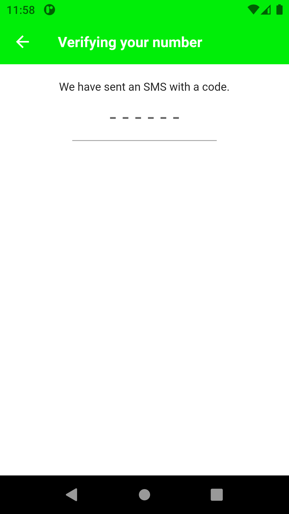

# No 1

Mampu mendemonstrasikan penyelesaian masalah dengan pendekatan matematika dan algoritma pemrograman secara tepat (Lampirkan link source code terkait)

Jawab:

Ada beberapa pendekatan matematika dan algoritma yang project ini pakai, salah satunya:

-Pendekatan matematika method untuk memformat tanggal pesan dikirim atau diterima.

- Method ini menerima data chatContactData sebagai parameter.
- Kemudian, ia menghitung selisih antara waktu pengiriman pesan terakhir dengan waktu saat ini dalam satuan hari menggunakan fungsi "difference" pada objek DateTime.
- Jika selisih ini adalah 0, artinya pesan terakhir dikirim hari ini, maka method akan memformat waktu pengiriman pesan terakhir menggunakan DateFormat.Hm() dan menyimpan hasilnya dalam variabel formattedDate.
- Jika selisih ini adalah 1, artinya pesan terakhir dikirim kemarin, maka method akan menyimpan string "Kemarin" dalam variabel formattedDate.
- Jika selisih ini lebih besar dari 1, artinya pesan terakhir dikirim lebih dari 1 hari yang lalu, maka method akan memformat waktu pengiriman pesan terakhir menggunakan DateFormat('dd/MM/yyyy') dan menyimpan hasilnya dalam variabel formattedDate.
- Akhirnya, method mengembalikan nilai formattedDate sebagai output.

```dart
// Method ini menerima data chatContactData sebagai parameter.
  String getLastMessageFormattedDate(ChatContact chatContactData) {
    // mengurutkan waktu pesan terkahir
    String formattedDate = '';
    if (chatContactData.timeSent.difference(DateTime.now()).inDays == 0) {
      formattedDate = DateFormat.Hm().format(chatContactData.timeSent);
    } else if (chatContactData.timeSent
            .difference(DateTime.now().subtract(const Duration(days: 1)))
            .inDays ==
        0) {
      formattedDate = 'Kemarin';
    } else {
      formattedDate = DateFormat('dd/MM/yyyy').format(chatContactData.timeSent);
    }
    return formattedDate;
  }
```

Sedangkan untuk contoh algoritma pemrograman yang digunakan project ini adalah algoritma pengurutan pesan

- dimana pesan terbaru akan diurutkan paling atas dalam home chat screen, menggunakan fungsi bawaan sorting dart
- Fungsi sort((a, b) => b.timeSent.compareTo(a.timeSent)) menggunakan algoritma pengurutan (sorting algorithm) yang disebut dengan Merge Sort atau Mergesort.
-

```dart
// urutkan list berdasarkan waktu terkirim, pesan terbaru di atas
List<Message> sortMessagesByTimeSent(List<Message> messages) {
  return messages
      .sort((a, b) => b.timeSent.compareTo(a.timeSent));
}
```

# No 2

Mampu menjelaskan algoritma dari solusi yang dibuat (Lampirkan link source code terkait)

Jawab:

# No 3

Mampu menjelaskan konsep dasar OOP

Jawab:

- Abstraction: Memperlihatkan fungsi utama dari Class yang dibutuhkan oleh publik dan menyembunyikan detail pelaksanaannya.
- Encapsulation: membatasi akses langsung ke data atau metod di dalam kelas dan mengatur akses tersebut.
- Inheritance: penurunan sikap dan perilaku dari Orang Tua (Parent / Superclass) ke Anaknya (Child / Subclass).
- Polymorphism :Subclass dapat memiliki implementasi method yang berbeda dari Superclass nya (banyak bentuk).

# No 4

Mampu mendemonstrasikan penggunaan Encapsulation secara tepat (Lampirkan link source code terkait)

Jawab:

Encapsulation membatasi akses langsung ke data atau metode di dalam kelas dan mengatur akses tersebut.

- pada Dart akses modifier terdapat 2 yaitu publik dan private
- Private ditandai dengan (\_) pada atribut atau methodnya. contoh dalam program saya
- **\_saveDataToContactsSubcollection**
- **\_saveMessageToMessageSubcollection**

```dart
// fungsi untuk mengirim pesan text
  void sendTextMessage({
    required BuildContext context,
    required String text,
    required String recieverUserId,
    required UserModel senderUser,
    required MessageReply? messageReply,
    required bool isGroupChat,
  }) async {
    try {
      var timeSent = DateTime.now();
      UserModel? recieverUserData;

      if (!isGroupChat) {
        var userDataMap =
            await firestore.collection('users').doc(recieverUserId).get();
        recieverUserData = UserModel.fromMap(userDataMap.data()!);
      }

      var messageId = const Uuid().v1();

      _saveDataToContactsSubcollection(
        senderUser,
        recieverUserData,
        text,
        timeSent,
        recieverUserId,
        isGroupChat,
      );

      _saveMessageToMessageSubcollection(
        recieverUserId: recieverUserId,
        text: text,
        timeSent: timeSent,
        messageType: MessageEnum.text,
        messageId: messageId,
        username: senderUser.name,
        messageReply: messageReply,
        recieverUserName: recieverUserData?.name,
        senderUsername: senderUser.name,
        isGroupChat: isGroupChat,
      );
    } catch (e) {
      showSnackBar(context: context, content: e.toString());
    }
  }
```

# No 5

Mampu mendemonstrasikan penggunaan Abstraction secara tepat (Lampirkan link source code terkait)

Jawab:

Abstraction: Memperlihatkan fungsi utama dari Class yang dibutuhkan oleh publik dan menyembunyikan detail pelaksanaannya.

- [Abstraction Auth](https://gitlab.com/fikiaprian23/TA_OOP/-/blob/master/lib/features/auth/abstraction/abstract.dart)
- [Abstraction Call](https://gitlab.com/fikiaprian23/TA_OOP/-/blob/master/lib/features/call/abstraction/abstrct_call.dart)
- [Abstraction Chat](https://gitlab.com/fikiaprian23/TA_OOP/-/blob/master/lib/features/chat/abstraction/abstract_chat.dart)
- [Abstraction Group](https://gitlab.com/fikiaprian23/TA_OOP/-/blob/master/lib/features/group/abstraction/abstract_group.dart)
- [Abstraction Contacts](https://gitlab.com/fikiaprian23/TA_OOP/-/blob/master/lib/features/select_contacts/abstraction/abstract_contacts.dart)
- [Abstraction Status](https://gitlab.com/fikiaprian23/TA_OOP/-/blob/master/lib/features/status/abstraction/abstract_status.dart)

# No 6

Mampu mendemonstrasikan penggunaan Inheritance dan Polymorphism secara tepat (Lampirkan link source code terkait)

Jawab:

- Inheritance adalah konsep dimana sebuah class dapat mewarisi properti dan method yang ada pada class lainnya. Pada codingan tersebut, **LoginScreen** dijadikan child class dari **ConsumerStatefulWidget**, sehingga LoginScreen dapat menggunakan semua properti dan method yang ada pada ConsumerStatefulWidget, termasuk juga memodifikasi dan menambahkannya.
- Polymorphism adalah konsep dimana sebuah class dapat berubah bentuk atau tampilan sesuai dengan implementasinya. Dalam codingan tersebut, **\_LoginScreenState** merupakan child class dari **ConsumerState<LoginScreen>**, dimana \_LoginScreenState mengimplementasikan **build method** dengan memodifikasi tampilan dari LoginScreen. Dalam method build, terdapat implementasi dari Loader Widget ketika isLoading bernilai true, dan juga terdapat implementasi dari tampilan Scaffold ketika isLoading bernilai false.

```dart
 // extends--> inheritance
class LoginScreen extends ConsumerStatefulWidget {
  static const routeName = '/login-screen';
  const LoginScreen({Key? key}) : super(key: key);

  //override => Polymorphism
  @override
  ConsumerState<LoginScreen> createState() => _LoginScreenState();
}

class _LoginScreenState extends ConsumerState<LoginScreen> {
  final phoneController = TextEditingController();
  Country? country;
  bool isLoading = false;

  //override => Polymorphism
  @override
  void dispose() {
    super.dispose();
    phoneController.dispose();
  }

// fungsi untuk memilih negara menggunakan plugin country_picker_flutter
  void pickCountry() {
    showCountryPicker(
        context: context,
        onSelect: (Country _country) {
          setState(() {
            country = _country;
          });
        });
  }

// fungsi untuk mengirim nomor telepon pengguna yang telah dimasukkan
  sendPhoneNumber() async {
    // trim untuk menghapus spasi awal dan akhir string
    String phoneNumber = phoneController.text.trim();

    if (country != null && phoneNumber.isNotEmpty) {
      setState(() {
        isLoading = true;
      });
      await ref.read(authControllerProvider).signInWithPhone(
            context,
            '+${country!.phoneCode}$phoneNumber',
          );

      setState(() {
        isLoading = false;
      });
    } else {
      showAlertDialog(context: context, message: 'Fill out all the fields');
    }
  }

  //override => Polymorphism
  @override
  Widget build(BuildContext context) {
    final size = MediaQuery.of(context).size;
    if (isLoading) return const Loader();

    return Scaffold(
      appBar: AppBar(
        title: const Text('Enter your phone number'),
        elevation: 0,
        backgroundColor: greenButton,
      ),
      body: SingleChildScrollView(
        child: Padding(
          padding: const EdgeInsets.all(18.0),
          child: Column(
            crossAxisAlignment: CrossAxisAlignment.center,
            children: [
              const Text('WhatsApp will need to verify your phone number.'),
              const SizedBox(height: 10),
              TextButton(
                onPressed: pickCountry,
                child: const Text('Pick Country'),
              ),
              const SizedBox(height: 5),
              Row(
                children: [
                  if (country != null) Text('+${country!.phoneCode}'),
                  const SizedBox(width: 10),
                  SizedBox(
                    width: size.width * 0.7,
                    child: TextField(
                      controller: phoneController,
                      decoration: const InputDecoration(
                        hintText: 'phone number',
                      ),
                    ),
                  ),
                ],
              ),
              SizedBox(height: size.height * 0.5),
              SizedBox(
                width: 90,
                child: CustomButton(
                  onPressed: sendPhoneNumber,
                  text: 'NEXT',
                ),
              ),
            ],
          ),
        ),
      ),
    );
  }
}

```

# No 7

Mampu menerjemahkan proses bisnis ke dalam skema OOP secara tepat. Bagaimana cara Kamu mendeskripsikan proses bisnis (kumpulan use case) ke dalam OOP ?

Jawab:

**USE CASE PRIORITY**
| Use Case | Priority | Status |
|------------------------------|----------|--------|
| Registrasi | Tinggi | Selesai
| Liat kontak | Tinggi | Selesai |
| Mengirim Pesan Teks | Tinggi | Selesai |
| Mengirim Pesan Suara | Tinggi | Selesai |
| Mengirim Pesan Video | Tinggi | Selesai |
| Menerima Pesan | Tinggi | Selesai |
| Menyimpan Pesan | Tinggi | Selesai |
| Membuat Grup | Tinggi | Selesai
| Mengirim Pesan di Grup | Tinggi | Selesai |
| Panggilan Suara | Tinggi | **Belum** |
| Panggilan Video | Tinggi | **Ongoing** |
| Mengirim Berkas | Tinggi | **Belum** |
| Menyimpan Riwayat Panggilan | Sedang | **Baru UI** |
| Mengatur Notifikasi | Sedang | **Belum** |
| Buat Status Teman | Sedang | **Baru Ui** |
| Melihat Status Teman | Sedang | **Baru Ui** |
| Liat Profil teman | Sedang | Selesai |
| Ubah profile | Sedang | **Belum** |

**USE CASE SCENARIO**

| Use Case                    | Aktor    | Aksi                                    | Reaksi Sistem Aplikasi Whatsapp      |
| --------------------------- | -------- | --------------------------------------- | ------------------------------------ |
| Registrasi                  | Pengguna | Memasukkan data registrasi              | Mendaftarkan pengguna ke sistem      |
| Lihat Kontak                | Pengguna | Membuka daftar kontak                   | Menampilkan daftar kontak            |
| Mengirim Pesan Teks         | Pengguna | Memilih kontak, memasukkan teks         | Mengirim pesan teks                  |
| Mengirim Pesan Suara        | Pengguna | Memilih kontak, merekam suara           | Mengirim pesan suara                 |
| Mengirim Pesan Video        | Pengguna | Memilih kontak, merekam video           | Mengirim pesan video                 |
| Menerima Pesan              | Pengguna | Menerima notifikasi pesan baru          | Menampilkan pesan pada layar         |
| Menyimpan Pesan             | Pengguna | Memilih pesan, memilih opsi             | Menyimpan pesan ke dalam penyimpanan |
| Membuat Grup                | Pengguna | Memilih opsi membuat grup               | Membuat grup                         |
| Mengirim Pesan di Grup      | Pengguna | Memilih grup, memasukkan pesan          | Mengirim pesan di grup               |
| Panggilan Suara             | Pengguna | Memilih kontak, memilih panggilan suara | Memulai panggilan suara              |
| Panggilan Video             | Pengguna | Memilih kontak, memilih panggilan video | Memulai panggilan video              |
| Mengirim Berkas             | Pengguna | Memilih kontak, memilih file            | Mengirim berkas                      |
| Menyimpan Riwayat Panggilan | Pengguna | Memilih opsi riwayat panggilan          | Menampilkan riwayat panggilan        |
| Mengatur Notifikasi         | Pengguna | Masuk ke pengaturan notifikasi          | Mengatur notifikasi aplikasi         |
| Buat Status Teman           | Pengguna | Masuk ke opsi buat status               | Membuat status teman                 |
| Melihat Status Teman        | Pengguna | Memilih opsi melihat status             | Menampilkan status teman             |
| Lihat Profil teman          | Pengguna | Memilih kontak, memilih profil          | Menampilkan profil teman             |
| Ubah Profile                | Pengguna | Masuk ke pengaturan profil              | Mengubah data profil pengguna        |

# No 8

Mampu menjelaskan rancangan dalam bentuk Class Diagram, dan Use Case table (Lampirkan diagram terkait)

Jawab:

# No 9

Mampu memberikan gambaran umum aplikasi kepada publik menggunakan presentasi berbasis video (Lampirkan link Youtube terkait)

Jawab:

# No 10

Inovasi UX (Lampirkan url screenshot aplikasi di Gitlab / Github)

Jawab:

- **Landing page**


- **Register**


- **OTP**



- **Grup**


- **User Chat**


- **History call**


- **Status**


- **Select Contact**


- **Chat Grup**


- **Chat Personal**


- **Profile teman**


